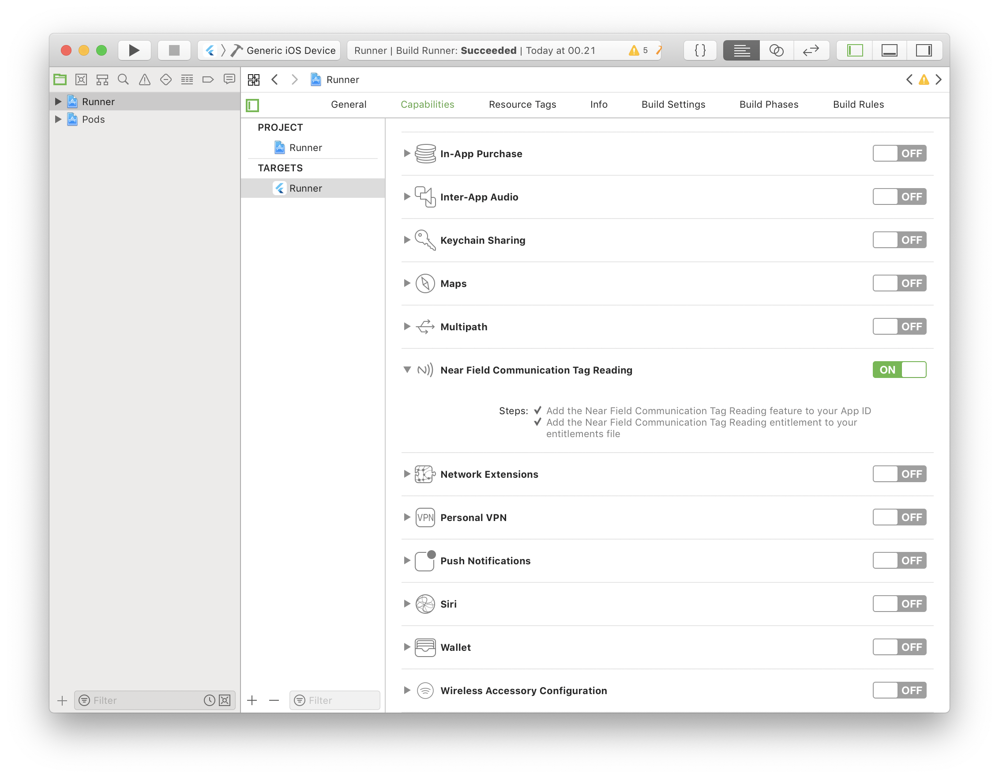

# Flutter NFC

This is flutter plugin for accessing the NFC features on Android and iOS.

Plugin to help developers looking to use internal hardware inside iOS or Android devices for reading and writing NFC tags.

The system activates a pooling reading session that stops automatically once a tag has been recognized. You can also trigger the stop event manually using a dedicated function.

Note: This plugin depends on `NFCTagReaderSession` (requires iOS 13.0 or later) and `NfcAdapter#enableReaderMode` (requires Android API level 19 or later).

## Getting Started

This project is a starting point for a Flutter [plug-in package](https://flutter.dev/developing-packages/), a specialized package that includes platform-specific implementation code for Android and iOS.

For help getting started with Flutter, view our [online documentation](https://flutter.dev/docs), which offers tutorials, samples, guidance on mobile development, and a full API reference.

## Supported NFC Format

The following nfc-tag-classes are available:

***Android and iOS***

* Ndef

***Android***

* NdefFormatable
* NfcA
* NfcB
* NfcF
* NfcV
* IsoDep
* MifareClassic
* MifareUtralight

***iOS***

* MiFare
* FeliCa
* Iso7816
* Iso15693

## Installation

Download or clone repository and add a dependency on the `flutter_nfc` package in the `dependencies` section of pubspec.yaml (recommend use this):

```yaml
dependencies:
  flutter_nfc:
    path: ../PATH_ROOT_DIRECTORY_PLUGIN/
```

or to get the experimental one:

```yaml
dependencies:
  flutter_nfc:
    git:
      url: https://github.com/skwcrd/flutter_nfc.git
      ref: main
```

and then run the shell.

```cmd
flutter pub get
```

last step import to the project:

```dart
import 'package:flutter_nfc/flutter_nfc.dart';
```

## Android Setup

* Add [android.permission.NFC](https://developer.android.com/reference/android/Manifest.permission.html#NFC) to your `AndroidMenifest.xml`

```xml
<uses-permission android:name="android.permission.NFC" />
```

If your app **requires** NFC, you can add the following to only allow it to be downloaded on devices that supports NFC:

```xml
<uses-feature
    android:name="android.hardware.nfc"
    android:required="true" />
```

* Assign 19 in minSdkVersion in the `build.gradle (Module: app)`

```gradle
defaultConfig {
    ...
    minSdkVersion 19
    ...
}
```

## iOS Setup

On iOS you must add turn on the Near Field Communication capability, add a NFC usage description and a NFC entitlement.

### Turn on Near Field Communication Tag Reading

Open your iOS project in Xcode, find your project's target and navigate to Capabilities. Scroll down to `Near Field Communication Tag Reading` and turn it on.

Turning on `Near Field Communication Tag reading`

* Adds the NFC tag-reading feature to the App ID.

* Enable Capabilities / Near Field Communication Tag Reading.
  * Add [Near Field Communication Tag Reader Session Formats Entitlements](https://developer.apple.com/documentation/bundleresources/entitlements/com_apple_developer_nfc_readersession_formats) to your entitlements.



from [developer.apple.com: Building an NFC Tag-Reader app](https://developer.apple.com/documentation/corenfc/building_an_nfc_tag-reader_app?language=objc)

### NFC Usage Description

Open your `ios/Runner/Info.plist` file. It's value should be a description of what you plan on using NFC for.

* Add [NFCReaderUsageDescription](https://developer.apple.com/documentation/bundleresources/information_property_list/nfcreaderusagedescription) to your `Info.plist`

```plist
<key>NFCReaderUsageDescription</key>
<string>...</string>
```

* Add [com.apple.developer.nfc.readersession.felica.systemcodes](https://developer.apple.com/documentation/bundleresources/information_property_list/systemcodes) and [com.apple.developer.nfc.readersession.iso7816.select-identifiers](https://developer.apple.com/documentation/bundleresources/information_property_list/select-identifiers) to your `Info.plist` as needed.

```plist
<key>com.apple.developer.nfc.readersession.felica.systemcodes</key>
<array>
    <string>...</string>
    ...
</array>

<key>com.apple.developer.nfc.readersession.iso7816.select-identifiers</key>
<array>
    <string>...</string>
    ...
</array>
```

In your Podfile add this code in the top.

```ruby
platform :ios, '13.0'
use_frameworks!
```

## IOS Specifics

When you call `NFCTagReaderSession(...)` on iOS, Core NFC (the iOS framework that allows NFC reading) opens a little window. On Android it just starts listening for NFC tag reads in the background.

* Timeout when used tag session.
  * when transceive timing open session approximately 20 second.
  * when wait tap a tag timing open session approximately 1 minute.

* IOS behaves a bit different in terms of NFC reading and writing.
  * Ids of the tags aren't possible in the current implementation.
  * each scan is visible for the user with a bottom sheet.


image from [developer.apple.com: Near Field Communication](https://developer.apple.com/design/human-interface-guidelines/ios/user-interaction/near-field-communication/)

## Error handling

Errors aren't exception to NFC in Flutter. The call function returned by `transceive(...)` can send via `ErrorCallback` different exceptions (iOS only), and even worse; they are different for each platform.


## Usage

**Handling Session**

```dart
// Check availability
bool isAvailable = await FlutterNfc.instance.isAvailable();

if ( isAvailable ) {
    // Start session
    FlutterNfc.instance.startSession(
        onTagDiscovered: (NFCTag tag) async {
            // Do something with an NFCTag instance.
        },
    );

    // Stop session
    FlutterNfc.instance.stopSession();
} else {
    FlutterNfc.instance.openSetting();
}
```

**Handling Platform Tag**

Obtain an instance by calling the method on the **NFCTag** class. For example:

```dart
final ndef = tag.ndef;

if (ndef == null) {
  print('Tag is not compatible with NDEF');
  return;
}

// Do something with an Ndef instance
```

## Real-World-App

See [this repo](https://github.com/skwcrd/flutter_nfc/tree/main/example) which is a Real-World-App demonstrates how to use this plugin.
